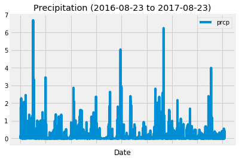
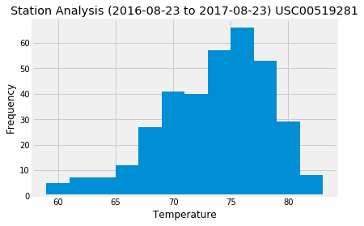

# Surf's Up!


```python
# Dependencies
from matplotlib import style
style.use('fivethirtyeight')
import matplotlib.pyplot as plt

import numpy as np
import pandas as pd

import datetime
from datetime import date
```

# Step 1 - Climate Analysis and Exploration


```python
# Python SQL toolkit and Object Relational Mapper
import sqlalchemy
from sqlalchemy.ext.automap import automap_base
from sqlalchemy.orm import Session
from sqlalchemy import create_engine, func, desc

# Create engine using the `hawaii.sqlite` database file
engine = create_engine("sqlite:///Resources/hawaii.sqlite")

# Reflect an existing database into a new model
Base = automap_base()
# Reflect the tables
Base.prepare(engine, reflect=True)

# We can view all of the classes that automap found
Base.classes.keys()
```


    ['measurement', 'station']


```python
# Save references to each table
Measurement = Base.classes.measurement
Station = Base.classes.station

# Create our session (link) from Python to the DB
session = Session(engine)
```

## Precipitation Analysis


```python
# Find the last date of measurements in the database and record it
prcp_data = session.query(Measurement.date) \
                   .distinct(Measurement.date) \
                   .order_by(desc(Measurement.date)) \
                   .first() 

# Check if last date found is correct
for row in prcp_data:
    last_date = row
    print(last_date)
    
```

    2017-08-23


```python
# Subract 1 years from the last date of measurements to find the beginning date for our query
last_date_obj = datetime.datetime.strptime(last_date, "%Y-%m-%d")
first_date_obj = last_date_obj.replace(last_date_obj.year - 1)

# Check if first date found is correct
first_date = str(first_date_obj.date())
print (first_date)

```

    2016-08-23


```python
# Design a query to retrieve the last 12 months of precipitation data
prcp_data = session.query(Measurement.date, Measurement.prcp) \
                   .filter(Measurement.date >= first_date) \
                   .order_by(Measurement.date) \
                   .all()

# Set above query results to dataframe
df_prcp_data = pd.DataFrame(data=prcp_data)
# Drop any NaN records
df_prcp_data = df_prcp_data.dropna(how='any')
# Set the index to the date column
df_prcp_data = df_prcp_data.set_index("date")
df_prcp_data.head()
```


<div>
<style scoped>
    .dataframe tbody tr th:only-of-type {
        vertical-align: middle;
    }

    .dataframe tbody tr th {
        vertical-align: top;
    }

    .dataframe thead th {
        text-align: right;
    }
</style>
<table border="1" class="dataframe">
  <thead>
    <tr style="text-align: right;">
      <th></th>
      <th>prcp</th>
    </tr>
    <tr>
      <th>date</th>
      <th></th>
    </tr>
  </thead>
  <tbody>
    <tr>
      <th>2016-08-23</th>
      <td>0.00</td>
    </tr>
    <tr>
      <th>2016-08-23</th>
      <td>0.15</td>
    </tr>
    <tr>
      <th>2016-08-23</th>
      <td>0.05</td>
    </tr>
    <tr>
      <th>2016-08-23</th>
      <td>0.02</td>
    </tr>
    <tr>
      <th>2016-08-23</th>
      <td>1.79</td>
    </tr>
  </tbody>
</table>
</div>


```python
# Plot the results using the DataFrame plot method
df_prcp_data.plot(kind="line")

# Define labels
tmp = " to "
plt.title("Precipitation (" + first_date + tmp + last_date + ")")
plt.xlabel("Date")

# Define and position legend
plt.legend(loc="upper right")

# Show plot
plt.show()
```





```python
# Use Pandas to calcualte the summary statistics for the precipitation data
df_prcp_data.describe()
```


<div>
<style scoped>
    .dataframe tbody tr th:only-of-type {
        vertical-align: middle;
    }

    .dataframe tbody tr th {
        vertical-align: top;
    }

    .dataframe thead th {
        text-align: right;
    }
</style>
<table border="1" class="dataframe">
  <thead>
    <tr style="text-align: right;">
      <th></th>
      <th>prcp</th>
    </tr>
  </thead>
  <tbody>
    <tr>
      <th>count</th>
      <td>2021.000000</td>
    </tr>
    <tr>
      <th>mean</th>
      <td>0.177279</td>
    </tr>
    <tr>
      <th>std</th>
      <td>0.461190</td>
    </tr>
    <tr>
      <th>min</th>
      <td>0.000000</td>
    </tr>
    <tr>
      <th>25%</th>
      <td>0.000000</td>
    </tr>
    <tr>
      <th>50%</th>
      <td>0.020000</td>
    </tr>
    <tr>
      <th>75%</th>
      <td>0.130000</td>
    </tr>
    <tr>
      <th>max</th>
      <td>6.700000</td>
    </tr>
  </tbody>
</table>
</div>


## Station Analysis


```python
# Count all unique stations from Measurement table
station_count  = session.query(Measurement) \
                        .group_by(Measurement.station) \
                        .count()

# How many stations are available in this dataset?
print("Total Number of stations: "  + str(station_count))

```

    Total Number of stations: 9


```python
# Find most active stations from Measurement table
station_activity = session.query(Measurement.station, func.count(Measurement.tobs)) \
                          .group_by(Measurement.station) \
                          .order_by(func.count(Measurement.tobs).desc()) \
                          .all()

# List the stations and the counts in descending order
df_station_activity = pd.DataFrame(data=station_activity, columns=['Station', 'Count'])
df_station_activity.head(10)
```


<div>
<style scoped>
    .dataframe tbody tr th:only-of-type {
        vertical-align: middle;
    }

    .dataframe tbody tr th {
        vertical-align: top;
    }

    .dataframe thead th {
        text-align: right;
    }
</style>
<table border="1" class="dataframe">
  <thead>
    <tr style="text-align: right;">
      <th></th>
      <th>Station</th>
      <th>Count</th>
    </tr>
  </thead>
  <tbody>
    <tr>
      <th>0</th>
      <td>USC00519281</td>
      <td>2772</td>
    </tr>
    <tr>
      <th>1</th>
      <td>USC00519397</td>
      <td>2724</td>
    </tr>
    <tr>
      <th>2</th>
      <td>USC00513117</td>
      <td>2709</td>
    </tr>
    <tr>
      <th>3</th>
      <td>USC00519523</td>
      <td>2669</td>
    </tr>
    <tr>
      <th>4</th>
      <td>USC00516128</td>
      <td>2612</td>
    </tr>
    <tr>
      <th>5</th>
      <td>USC00514830</td>
      <td>2202</td>
    </tr>
    <tr>
      <th>6</th>
      <td>USC00511918</td>
      <td>1979</td>
    </tr>
    <tr>
      <th>7</th>
      <td>USC00517948</td>
      <td>1372</td>
    </tr>
    <tr>
      <th>8</th>
      <td>USC00518838</td>
      <td>511</td>
    </tr>
  </tbody>
</table>
</div>


```python
# Which station has the highest number of observations?
station_1_ID = df_station_activity["Station"][0]

print("Station with highest number of observatoins: "  + station_1_ID)

```

    Station with highest number of observatoins: USC00519281


```python
# Choose the station with the highest number of temperature observations.
# Query the last 12 months of temperature observation data for this station and plot the results as a histogram
station_1 = session.query(Measurement.station, Measurement.date, Measurement.tobs) \
                   .filter(Measurement.station == station_1_ID) \
                   .filter(Measurement.date >= first_date) \
                   .all()

df_station_1 = pd.DataFrame(data=station_1)
df_station_1.head()
```


<div>
<style scoped>
    .dataframe tbody tr th:only-of-type {
        vertical-align: middle;
    }

    .dataframe tbody tr th {
        vertical-align: top;
    }

    .dataframe thead th {
        text-align: right;
    }
</style>
<table border="1" class="dataframe">
  <thead>
    <tr style="text-align: right;">
      <th></th>
      <th>station</th>
      <th>date</th>
      <th>tobs</th>
    </tr>
  </thead>
  <tbody>
    <tr>
      <th>0</th>
      <td>USC00519281</td>
      <td>2016-08-23</td>
      <td>77.0</td>
    </tr>
    <tr>
      <th>1</th>
      <td>USC00519281</td>
      <td>2016-08-24</td>
      <td>77.0</td>
    </tr>
    <tr>
      <th>2</th>
      <td>USC00519281</td>
      <td>2016-08-25</td>
      <td>80.0</td>
    </tr>
    <tr>
      <th>3</th>
      <td>USC00519281</td>
      <td>2016-08-26</td>
      <td>80.0</td>
    </tr>
    <tr>
      <th>4</th>
      <td>USC00519281</td>
      <td>2016-08-27</td>
      <td>75.0</td>
    </tr>
  </tbody>
</table>
</div>


```python
# Plot the temperature data in a histogram with 12 bins

plt.hist(df_station_1['tobs'], 12)
plt.xlabel("Temperature")
plt.ylabel("Frequency")
plt.title("Station Analysis (" + first_date + tmp + last_date + ") " + station_1_ID)

# Show plot
plt.show()

```





## Step 2 - Climate App 
